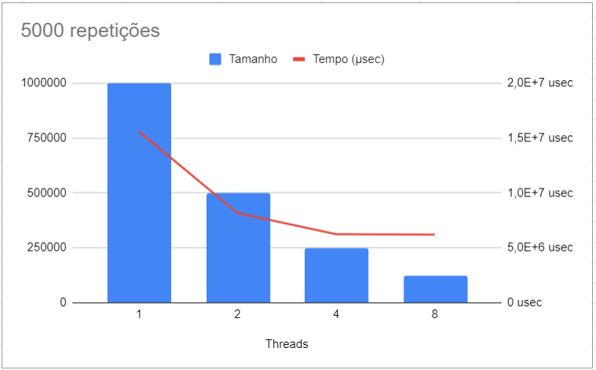

# Trabalho 2

Talles Siqueira Ceolin - Programação Paralela

## Questões Pthreads
#### 1. Explique como se encontram implementadas as 4 etapas de projeto: particionamento, comunicação, aglomeração, mapeamento (use trechos de código para ilustrar a explicação).

Particionamento:

```c
33 int wsize = dotdata.wsize;
34 int start = offset*wsize;
35 int end = start + wsize;
36 double mysum;
37
38 for (k = 0; k < dotdata.repeat; k++) {
39     mysum = 0.0;
40     for (i = start; i < end ; i++)  {
41         mysum += (a[i] * b[i]);
42     }
43 }
```

Comunicação:
```c
45  pthread_mutex_lock (&mutexsum);
46  dotdata.c += mysum;
47  pthread_mutex_unlock (&mutexsum);
```  

Aglomeração:

Mapeamento:

#### 2. Considerando o tempo (em microssegundos) mostrado na saída do programa, qual foi a aceleração (speedup) com o uso de threads?

    1 thread: 6581982 µsec
    2 threads: 3234973 µsec

    Speedup = 2,0346

#### 3. A aceleração se sustenta para outros tamanhos de vetores, números de threads e repetições? Para responder a essa questão, você terá que realizar diversas execuções, variando o tamanho do problema (tamanho dos vetores e número de repetições) e o número de threads (1, 2, 4, 8..., dependendo do número de núcleos). Cada caso deve ser executado várias vezes, para depois calcular-se um tempo de processamento médio para cada caso. Atenção aos fatores que podem interferir na confiabilidade da medição: uso compartilhado do computador, tempos muito pequenos, etc.


#### 4. Elabore um gráfico/tabela de aceleração a partir dos dados obtidos no exercício anterior.

| Threads | Tamanho | Repetições | Tempo (µsec) |
|:-------:|:-------:|:----------:|:------------:|
|    1    | 1000000 |    2000    |    6215641   |
|    1    | 1000000 |    5000    |   15596042   |
|    1    | 1000000 |    10000   |   31066660   |
|    2    |  500000 |    2000    |    3252002   |
|    2    |  500000 |    5000    |    8164687   |
|    2    |  500000 |    10000   |   16156287   |
|    4    |  250000 |    2000    |    2496588   |
|    4    |  250000 |    5000    |    6248320   |
|    4    |  250000 |    10000   |   12487091   |
|    8    |  125000 |    2000    |    2481327   |
|    8    |  125000 |    5000    |    6208677   |
|    8    |  125000 |    10000   |   12558228   |
Tabela também no arquivo results.csv





#### 5. Explique as diferenças entre pthreads_dotprod.c e pthreads_dotprod2.c. Com as linhas removidas, o programa está correto?

Embora sejá possível o programa funcionar da mesma maneira, sem a implementação dos *mutex* existe o risco de haver interferência entre as threads ou uma possível parada na execução.